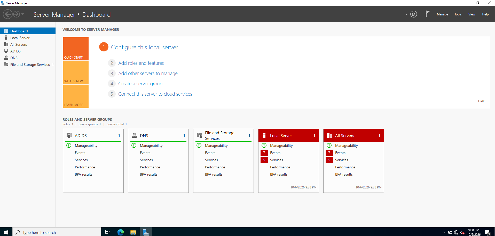
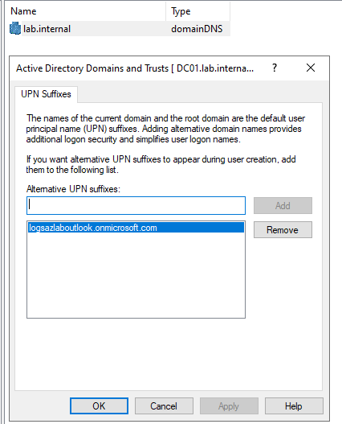
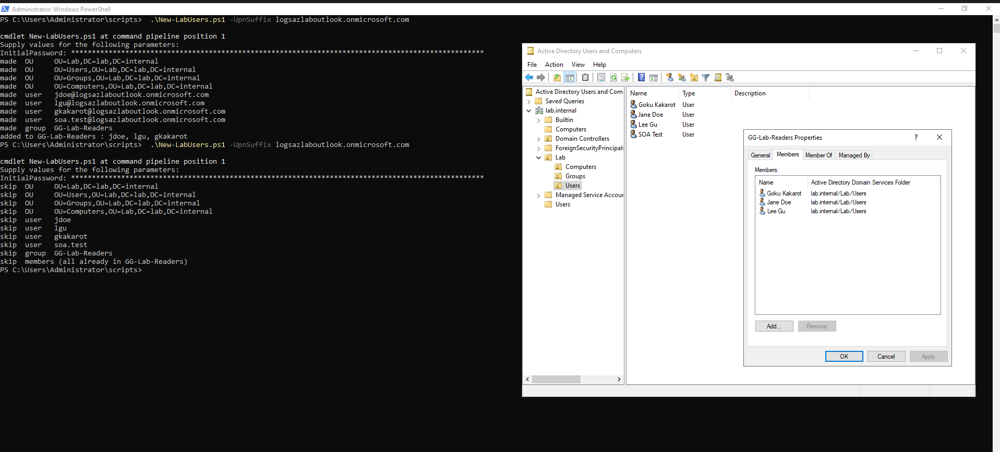
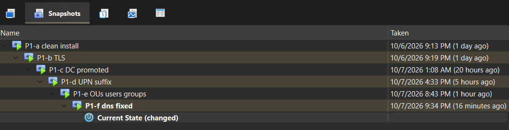

# P1: On-prem Active Directory

**Goal:** a working domain controller whose users already have cloud-ready sign-in names.

## What was built

1. **DC01 VM** with two adapters: NAT (outbound internet) and Internal Network `labnet`
   (lab traffic only). See [setup](../README.md#setup).
2. **Windows Server 2022, Desktop Experience.** 
3. **Static IP** `10.0.0.10` on `labnet`. There's no DHCP on the lab network.
4. **TLS 1.2 enforced** in the registry, a Cloud Sync agent requirement.
5. **Promoted to a new forest**, `lab.internal`, with AD-integrated DNS and
   forwarders to `1.1.1.1` and `8.8.8.8`.
6. **Fixed DNS for a two-NIC DC** so only the lab address is published.
   See [troubleshooting](troubleshooting.md).
7. **Added the UPN suffix** `<tenant>.onmicrosoft.com` before creating any users,
   so on-prem and cloud sign-in names match.
8. **Scripted OUs, users and groups** with [`New-LabUsers.ps1`](../scripts/New-LabUsers.ps1).




## The script

```powershell
.\New-LabUsers.ps1 -UpnSuffix <tenant>.onmicrosoft.com
Get-Help .\New-LabUsers.ps1 -Full
```

Creates `Lab` → `Users` / `Groups` / `Computers`, four users and `GG-Lab-Readers`.
Prompts for the password and stores nothing. Safe to rerun: the second run skips everything.



## Verify

```powershell
nslookup lab.internal          # only 10.0.0.10
Get-ADUser -Filter * -SearchBase "OU=Users,OU=Lab,DC=lab,DC=internal" |
    Select Name, UserPrincipalName   # every UPN ends in the onmicrosoft.com suffix
```

## Snapshots

`P1-a` clean install → `P1-b` TLS → `P1-c` promoted → `P1-d` UPN suffix →
`P1-e` users and groups → `P1-f` DNS fixed, reboot-verified


