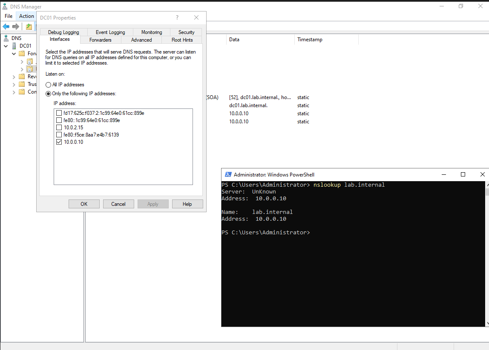

# Troubleshooting log

Problems hit while building the lab, newest at the bottom.

## 2026-10-06: DC kept publishing its NAT address in DNS

**Symptom:** `nslookup lab.internal` returned `10.0.2.15` alongside `10.0.0.10`.
`10.0.2.15` is DC01's VirtualBox NAT address.

**Fix (first pass):**
- Turned off *Register this connection's addresses in DNS* on the NAT adapter
- Stopped Netlogon from registering the extra records (`DnsAvoidRegisterRecords`)
- Deleted the stale records

**2026-10-07: it came back** after patching:
`dc01` had an A record for `10.0.2.15` and an AAAA record for the NAT adapter's IPv6 address.

**Root cause:** the DNS server was listening on every address on the machine.
A DNS server publishes host records for its own name using the addresses it listens on,
so every restart re-added the NAT addresses.

**Fix:** DNS server → Interfaces → listen on `10.0.0.10` only, then removed the stale records.

```powershell
$s = Get-DnsServerSetting -All
$s.ListeningIPAddress = @('10.0.0.10')
Set-DnsServerSetting -InputObject $s
```

**Verified after a reboot:** only `10.0.0.10` in the zone and in `nslookup`.



## 2026-10-07: script rerun failed with "name already in use"

**Symptom:** the second run of `New-LabUsers.ps1` stopped with
*an object with a name that is already in use*.

**Cause:** the skip check only matched `SamAccountName`. A user from the first run had
the same display name but a different sam, so the script tried to create it again,
and AD requires names to be unique within an OU.

**Fix:** check for both sam and name.

## 2026-10-08: VirtualBox running on the Windows hypervisor (turtle icon)

**Symptom:** green turtle in the VM status bar; DC tasks were very slow.
After researching, discovered it means VirtualBox cannot use VT-x directly
and is running on the Windows Hypervisor.

**Ruled out:**
- Hyper-V, Virtual Machine Platform, Windows Hypervisor Platform, WSL: none enabled
  (my host is Windows 11 Home, which can't install the Hyper-V feature)
- `bcdedit` `hypervisorlaunchtype Off` and `vsmlaunchtype off`: hypervisor still loaded
- `DeviceGuard\EnableVirtualizationBasedSecurity = 0`: VBS still running
- Memory Integrity (HVCI) and Credential Guard: both already off

**Root cause:** SkTool (Windows SDK) reported `VBS is enabled due to: VBS registry configuration`
with `VSM required` and `Key Guard: 1`. The only VBS consumer was Key Guard, which isolates
Windows Hello keys, and the only scenario still on was `Scenarios\WindowsHello\Enabled = 1`.
Because VSM was required, the boot settings above were ignored.

**Fix:** backed up the DeviceGuard key, turned off the Hello scenario, rebooted, reset the Hello PIN.

```powershell
reg export HKLM\SYSTEM\CurrentControlSet\Control\DeviceGuard "$HOME\deviceguard-backup.reg"
Set-ItemProperty HKLM:\SYSTEM\CurrentControlSet\Control\DeviceGuard\Scenarios\WindowsHello -Name Enabled -Value 0
```

**Verified after a reboot:** `HypervisorPresent` False, scenario still `0`, dreaded turtle gone.

**Tradeoff:** Hello keys are still TPM-protected but no longer VBS-isolated. This is temporary. 
